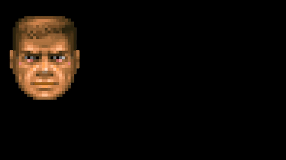

# fbgl: Lightweight 2D Framebuffer Library for Linux

`fbgl` (Framebuffer Graphics Library) is a minimalistic, **header-only** 2D framebuffer library written in C. Designed for simplicity and performance, `fbgl` provides an intuitive API for directly manipulating the Linux framebuffer device (`/dev/fb0`). Whether you're experimenting with low-level graphics or building lightweight graphical applications, `fbgl` offers the foundation you need.

---

## Features

- **Header-only design**: Include `fbgl.h` and start coding.
- **Direct framebuffer rendering**: Writes directly to `/dev/fb0` for high performance.
- **Simple API**: Easy-to-use functions for initializing, clearing, and drawing.
- **Lightweight**: Minimal dependencies, using only standard Linux libraries.
- **Custom rendering**: Draw pixels, lines, and shapes directly to the framebuffer.

---

## Getting Started

### Prerequisites

- A Linux-based system with framebuffer support.
- Development tools like GCC.
- Access to `/dev/fb0` (requires elevated permissions or proper user configuration).

### Installation

No installation is required! Simply copy the `fbgl.h` file into your project directory and include it in your source files.

```c
#include "fbgl.h"
```

---

## Usage

### Example Program

Here’s a simple program that initializes the framebuffer, clears it to a blue color, and draws a red diagonal line.

```c
#include <stdio.h>
#include "fbgl.h"

int main() {
    // Initialize the framebuffer
    if (fbgl_init("/dev/fb0") != 0) {
        fprintf(stderr, "Failed to initialize framebuffer\n");
        return 1;
    }

    printf("Framebuffer size: %dx%d\n", fbgl_get_width(), fbgl_get_height());

    // Clear framebuffer to blue
    fbgl_clear(0x0000FFFF); // Blue color

    // Draw a red diagonal line
    for (int i = 0; i < fbgl_get_width() && i < fbgl_get_height(); i++) {
        fbgl_put_pixel(i, i, 0xFFFF0000); // Red
    }

    // Wait for user input before exiting
    getchar();

    // Clean up
    fbgl_destroy();
    return 0;
}
```

Compile the program:

```bash
gcc -o example main.c
```

Run the program with elevated permissions to access `/dev/fb0`:

```bash
sudo ./example
```

---

## API Reference

### Initialization and Cleanup

#### `int fbgl_init(const char *device);`
Initializes the framebuffer.

- **Parameters**:  
  `device`: Path to the framebuffer device (e.g., `/dev/fb0`).

- **Returns**:  
  `0` on success, `-1` on failure.

#### `void fbgl_destroy(void);`
Destroys the framebuffer and releases resources.

---

### Drawing Functions

#### `void fbgl_clear(uint32_t color);`
Fills the entire framebuffer with a specified color.

- **Parameters**:  
  `color`: 32-bit ARGB color (e.g., `0xFFFF0000` for red).

#### `void fbgl_put_pixel(int x, int y, uint32_t color);`
Sets a pixel at the specified position to the given color.

- **Parameters**:  
  `x, y`: Pixel coordinates.  
  `color`: 32-bit ARGB color.

---

### Utility Functions

#### `int fbgl_get_width(void);`
Returns the width of the framebuffer in pixels.

#### `int fbgl_get_height(void);`
Returns the height of the framebuffer in pixels.

---

## How It Works

1. **Framebuffer Device**: `fbgl` uses the Linux framebuffer device (`/dev/fb0`) to directly access the screen memory.
2. **Memory Mapping**: The framebuffer is mapped into user-space memory using `mmap`, allowing for direct pixel manipulation.
3. **Direct Rendering**: Pixels are written directly to the framebuffer, bypassing higher-level graphics APIs.

---

## Limitations

- **Platform-specific**: Works only on Linux systems with framebuffer support.
- **Root permissions**: Access to `/dev/fb0` often requires `sudo`.
- **No hardware acceleration**: Rendering is done in software, so performance depends on CPU speed.

---

## Roadmap

Future improvements for `fbgl` may include:
- Support for double buffering.
- More advanced drawing primitives (e.g., circles, filled polygons).
- Cross-platform abstraction for non-Linux systems.
- Text rendering using bitmap fonts.
- Performance optimizations for large resolutions.

---

## Contributing

Contributions are welcome! If you’d like to improve `fbgl`, add features, or fix bugs:
1. Fork the repository.
2. Create a new branch for your changes.
3. Submit a pull request with a clear description of your updates.

---

## License

`fbgl` is licensed under the MIT License. See the `LICENSE` file for details.

---

## Acknowledgments

- Inspired by the simplicity of low-level graphics programming.
- Thanks to the Linux community for making framebuffer programming accessible!

---

---

## Showcase

First Texture Rendering


---

## Contact

If you have questions or suggestions, feel free to reach out via GitHub or email.

Happy coding with `fbgl`! 🚀
